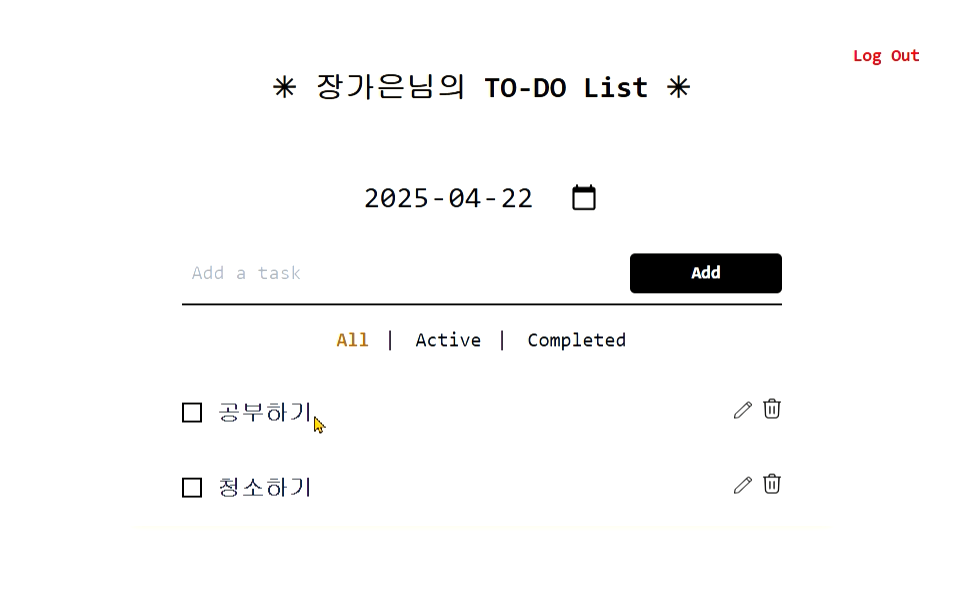
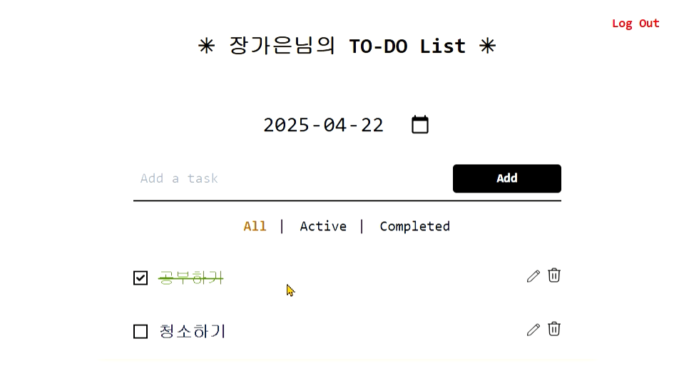
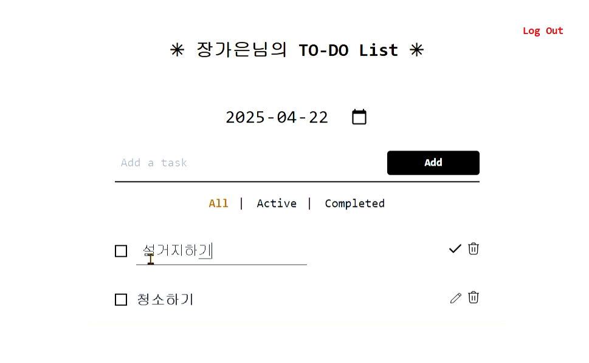

# To-Do List ✔️

**Next.js + Spring Boot** 미니 프로젝트

### 🎯 목표

- 할 일을 **조회, 추가, 수정, 삭제**할 수 있는 CRUD To-Do List 웹 개발
- **Spring Security**를 이용한 **회원가입/로그인인/로그아웃** 구현
- **Spring Boot + Next.js** 를 이용하여 구현
- 스타일링은 **Tailwind CSS** 사용하기
- DB는 **MySQL** 사용

### 📱 기능

**1. 회원가입/로그인**

.gif>)

**2. Task 조회/추가/수정/삭제**

- Task 추가
- Task 목록 날짜 별로 조회 가능
- All / Active / Completed 별로 조회 가능

- Task 상태변화(체크)

- Task 수정/삭제
